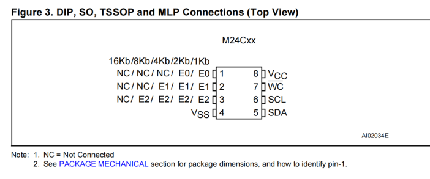

## IIC 协议的注意事项

- [IIC 协议的注意事项](#iic-协议的注意事项)
- [EEPROM 芯片 AT24C16(M24C16) 和 AT24C02(M24C02) 的区别](#eeprom-芯片-at24c16m24c16-和-at24c02m24c02-的区别)
- [硬件 IIC 和软件 IIC 的区别](#硬件-iic-和软件-iic-的区别)

## EEPROM 芯片 AT24C16(M24C16) 和 AT24C02(M24C02) 的区别

参考网址：https://blog.csdn.net/liukais/article/details/85944645

- 他们都是通过 IIC 协议进行读写的；IIC 在总线上读写需要知道设备地址；
  - 默认设备地址：1010 E2 E1 E0；
- 但是 AT24C02 和 AT24C16 区别在于后面的 E2 E1 E0
  - AT24C02：由于寻址范围是 2Kbit = 256 * 8；即可以存储 256 字节；
    - 使用 8 位寻址可以满足，所以，E2 E1 E0 可以由用户定义地址；
  - AT24C16：由于寻址范围是 16Kbit = 128 * 16 * 8；即可以存储 2048 字节；
    - 使用 8 位寻址不可以满足，所以，E2 E1 E0 这里充当寻址的高 3 位
    - 再加上后面的 8 位寻址 8 + 3 是 11 位：2^11 = 2048；可以满足寻址要求
    - 有 128 页，每页有 16 Byte；128 由高 7 位地址位组成，后 4 位是页地址偏移量
    - 因此 AT24C16 的地址是 1010 A10 A9 A8 实际的引脚无效 NC

```
所以在编写程序对AT24C16第100页的第3个字节进行写数据的时候，步骤如下：

1）发送起始信号；

2）发送器件地址0XA6（1010 0110，1010是固定地址，011是页地址的高三位，0表示写操作）；

3）发送操作地址0X43（0100 0011，0100是页地址的低四位，0011是页地址偏移量，即第100页内的第三个字节，

4）发送要写的数据，

5）发送终止信号。
```



## 硬件 IIC 和软件 IIC 的区别

参考网址：https://blog.csdn.net/qq_31860135/article/details/88658136

- 硬件 IIC：使用芯片上 I2C 的外设；
  - 受管脚限制，不灵活，但是效率高于软件 I2C；
  - 要配置寄存器，用法复杂；但可以使用 DMA；
  - 某些芯片 I2C 不太稳定，调试文件较多
- 软件 IIC：使用一般的 GPIO 管脚，模拟 I2C 通信波形
  - 不受管脚限制，灵活，效率相对较低
  - 代码量大，程序繁琐，但不复杂
  - 稳定，流程清楚；
