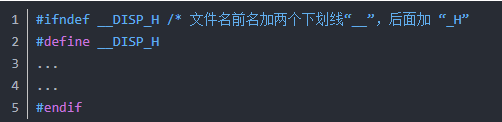
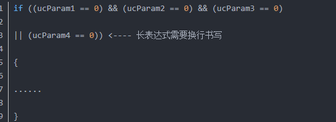
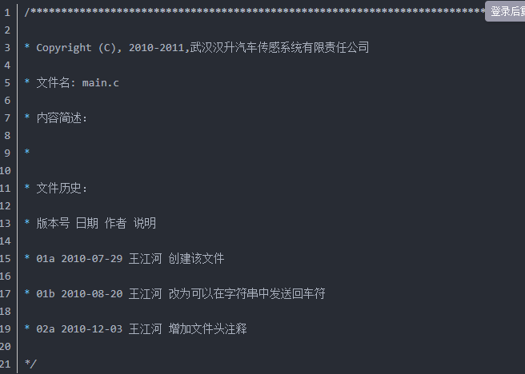
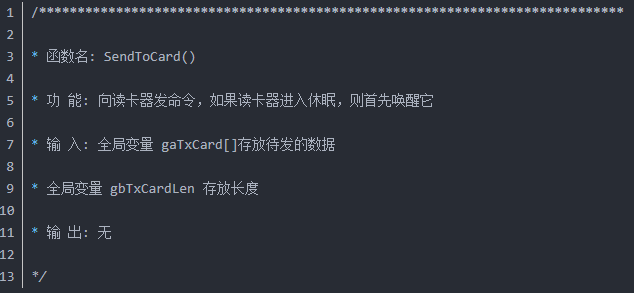
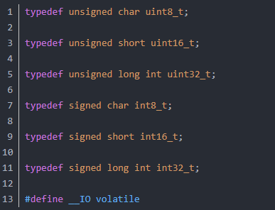
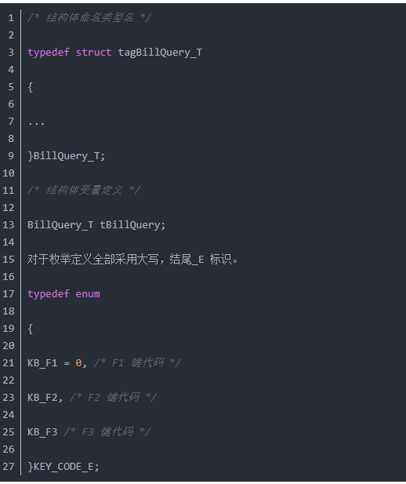
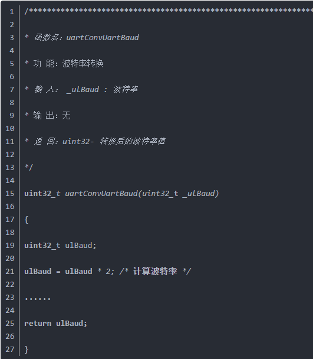

# 全局变量和命名规则

- [全局变量和命名规则](#全局变量和命名规则)
  - [不要再祸害C语言了！滥用“全局变量”的后果居然如此严重？](#不要再祸害c语言了滥用全局变量的后果居然如此严重)
    - [参考网址](#参考网址)
    - [重点总结](#重点总结)
      - [变量介绍](#变量介绍)
      - [新手常犯的错误](#新手常犯的错误)
      - [不能使用全局变量，那编写程序的对策](#不能使用全局变量那编写程序的对策)
      - [大量使用局部变量也会容易造成栈溢出](#大量使用局部变量也会容易造成栈溢出)
  - [volatile static 用法](#volatile-static-用法)
    - [参考网址](#参考网址-1)
    - [注意问题](#注意问题)
      - [static 用法](#static-用法)
      - [volatile 用法](#volatile-用法)
    - [一个参数既可以是const还可以是volatile吗？](#一个参数既可以是const还可以是volatile吗)
      - [const 介绍](#const-介绍)
      - [const 和 define](#const-和-define)
  - [命名规则](#命名规则)
    - [常用方法](#常用方法)
    - [命名](#命名)
  - [安富莱的编码规范](#安富莱的编码规范)
  - [我的编码风格](#我的编码风格)

## 不要再祸害C语言了！滥用“全局变量”的后果居然如此严重？

### 参考网址

- <https://www.eet-china.com/mp/a14609.html>

### 重点总结

#### 变量介绍

|              |                                                        |
| ------------ | ------------------------------------------------------ |
| 全局变量     | 所有文件都可见，外部文件用 ‘extern’ 声明， 存储在 SRAM |
| 局部变量     | 仅在进入函数体内可用， 退出后空间收回， 存储在栈空间   |
| 静态全局变量 | 仅在本文件可以使用， 其他文件不可访问， 存储在 SRAM    |
| 静态局部变量 | 仅在进入函数体内可用， 始终保存， 存储在 SRAM          |

#### 新手常犯的错误

> - 最易范的错误是全局变量满天飞， 这帮家伙几乎把全局变量当作函数形参来用.
> - 由于软件的分层不合理，到了后期维护，哪怕仅是增加修改删除小功能，往往要从上到下掘地三尺地修改
> - 全局变量大量使用，少不了有些变量流连忘返于中断与主回圈程序之间。这个时候如果处理不当，系统的bug就是随机出现的，无规律的

#### 不能使用全局变量，那编写程序的对策

> - 能不用全局变量尽量不用
> >
> > - 我想除了系统状态和控制参数、通信处理和一些需要效率的模块，其他的基本可以靠合理的软件分层和编程技巧来解决
>
> - 如果不可避免需要用到，那能藏多深就藏多深。
>
> > - 1)如果只有某.c文件用，就static到该文件中，顺便把结构体定义也收进来；
> > - 2)如果只有一个函数用，那就static到函数里面去；
> > - 3)如果非要开放出去让人读取，那就用函数return出去，这样就是只读属性了；
> > - 4)如果非要遭人蹂躏赋值，好吧，我开放函数接口让你传参赋值；
> > - 5)实在非要extern我，我还可以严格控制包含我.h档的对象，而不是放到公共的includes.h中被人围观，丢人现眼。

#### 大量使用局部变量也会容易造成栈溢出

> 1.全局变量是不可避免要用到的
> >
> > 每一个设备底层几乎都需要它来记录当前状态，控制时序，起承转合。
> > 但是尽量不要用来传递参数，这个很忌讳的。
>
> 2.尽量把变量的作用范围控制在使用它的模块里面
> >
> > - 如果其他模块要访问，就开个读或写函数接口出来，严格控制访问范围。
> > - 这一点，C++的private属性就是这么干的。这对将来程序的调试也很有好处。
> > - C语言之所以有++版本，很大原因就是为了控制它的灵活性，要说面向对象的思想，C语言早已有之，亦可实现。
>
> 3.当一个模块里面的全局变量超过3个(含)时，就用结构体包起来吧。
> >
> > - 要归0便一起归0，省得丢三落四的。
> 4.在函数里面开个静态的全局变量，全局数组，是不占用栈空间的
> >
> > - 静态的 存放在 SRAM; 防止栈爆掉
> 5.程序模型？如何分析抽象出来呢，从哪个角度进行模型构建呢？
> >
> > - 本人一直以来都是从两个角度分析系统，事件--**状态机迁移图** 和 **数据流图**，前者分析控制流向，完善UI，后者可知晓系统数据的缘起缘灭。

## volatile static 用法

### 参考网址

- <https://blog.csdn.net/martinue/article/details/87624342>

### 注意问题

#### static 用法

- 不可重入函数
- 所谓的函数是可重入的（也可以说是可预测的），即：只要输入数据相同就应产生相同的输出。

```
// 这个函数之所以是不可预测的
unsigned int sum_int( unsigned int base )
{
　unsigned int index;
　static unsigned int sum = 0; // 注意，是static类型的。
　for (index = 1; index <= base; index++)
　{
　　sum += index;
　}
　return sum;
}
```

- 将声明sum变量中的static关键字去掉, 函数即变为一个可重入的函数
- 当然，有些时候，在函数中是必须要使用static变量的，比如当某函数的返回值为指针类型时，则必须是static的局部变量的地址作为返回值，若为auto类型，则返回为错指针。

#### volatile 用法

- 遇到这个关键字声明的变量，编译器对访问该变量的代码就不再进行优化， 每次都要到变量的地址中去读取变量的数据
- 编译器如何优化变量：
  - 比如： int a=1;  a=2;  a=3; 编译器认为 a=3 才有意义，所以，a = 3 会被暂存，每次用 a 编译器默认用 3，但是 a 可能在中断或多线程被改了，此时，a 依旧等于3，数据就会出错

- 使用 volatile 的场景：
  - 在中断服务中使用的变量，如果不使用 volatile 可能会出现中断中无法改变数据
  - 多任务环境下各任务共享的标志位，或通信数据，或状态机
  - 存储器映射的硬件寄存器，比如 STM32 库函数中的前缀 __I 和 __IO 就是用 volatile

### 一个参数既可以是const还可以是volatile吗？

- 可以的，例如只读的状态寄存器。它是volatile因为它可能被意想不到地改变。它是const因为程序不应该试图去修改它。软件不能改变，并不意味着我硬件不能改变你的值，这就是单片机中的应用

#### const 介绍

- 参考网址： http://c.biancheng.net/view/217.html

- const 定义的是变量，但又相当于常量；说它定义的是常量，但又有变量的属性，所以叫常变量
- const 定义的变量的值是不允许改变的，即不允许给它重新赋值
- 用 const 修饰的变量，无论是全局变量还是局部变量，生存周期都是程序运行的整个过程
- 经过 const 修饰过的变量存储在内存中的“只读数据段”中

#### const 和 define

- define定义的宏是在预处理阶段展开的； 而const定义的只读变量是在编译运行阶段使用的
- define定义的宏在编译后就不存在了，它不占用内存； const定义的常变量本质上仍然是一个变量，具有变量的基本属性，有类型、占用存储单元
- 编译器可以对 const 进行类型安全检查，而对 define 只是机械地进行字符替换，没有类型安全检查

## 命名规则

### 常用方法

- 常用的命名方法有两种，一种是 Pascal 命名法（帕斯卡命名法），另一种是 Camel 命名法（驼峰命名法）
- Pascal 命名法是指每个单词的首字母大写；Camel 命名法是指第一个单词小写，从第二个单词开始每个单词的首字母大写

### 命名

变量名

- 变量的命名规则遵循 Camel 命名法，例如：studentName
- 全局变量：gSystemCounter
- 局部变量：lMainTimer

常量的命名

- 全部大写，类似宏定义
- 常量： PIR_SET_TIME_SEC_5

类的命名

- 类的命名规则遵循 Pascal 命名法，例如：Student

接口的命名

- 接口的命名规则遵循 Pascal 命名法，通常用 I 开头
- 例如：ICompare

方法的命名

- 方法的命名规则遵循 Pascal 命名法，一般采用动词来命名
- 例如： AddUser

## 安富莱的编码规范

- 参考网址：https://blog.csdn.net/zhuimeng_ruili/article/details/106600567

整体是使用的驼峰命名法（Camel-Case）；以后的编码推荐使用这种方法

- 文件和目录
  - 1、文件命名
    - 方法一：写模块功能标识
      - 前两个小写字母表示模块功能；mpMain.c; mpDisp.c
    - 方法二：不写模块功能标识
      - Main.c; Disp.c
  - 2、头文件段落安排顺序
    - a、文件头注释
    - b、防止重复引用头文件的设置
    - c、#include 部分
    - d、#define 部分
    - e、enum 常量声明
    - f、类型声明和定义，包括 struct、union、typedef 等
    - g、全局变量声明
    - h、文件级变量声明
    - i、全局或文件级函数声明
    - j、函数实现。按函数声明的顺序排列
    - k、文件尾注释
  - 3、头文件使用相对路径
    - #include “C:/Project/inc/hello.h” 不推荐；
    - #include “../inc/hello.h” 推荐；
  - 4、防止头文件被重复引用；应当用 #ifndef/#define/#endif 结构产生预处理块
    - #ifndef __PORT_H
    - 前面加两个下划线 “__”
  - 5、头文件只存放 “声明” 不存放 “定义”
    - 本文件的 .h 里面放本文件 .c 的声明
    - 不要在 .c 文件声明别的全局变量
    - 如果其他模块要用到本文件的全局变量，需要包含本文件头文件
  - 6、文件长度不能太长，尽量保持 1000 行以内



- 排版
  - 变量和语句之间空一行；不同功能模块直接空一行
  - 长表达要换行书写；符号在开头



- 注释
  - 文件头注释；函数注释；语句注释；
  - 注释写为什么，不要写做什么
  - 建议使用 /*  */；因为有些编译器不支持 "//"
  - 推荐使用中文注释；好吗？
  - 常用的单词缩写
    - temp 可缩写为 tmp;
    - flag 可缩写为 flg;
    - statistic 可缩写为 stat;
    - increment 可缩写为 inc;
    - message 可缩写为 msg;




- 变量，结构，常量，宏
- 变量：
  - 前缀使用 g（全局变量），s（静态变量）；ul（uint32）；uc（uint8）
  - 全局变量：g_ulParaWord； g_ucByte；
  - 静态变量：s_ulParaWord； s_ucByte；
  - 函数内的局部变量不用前缀；
- 变常量：
  - 变常量 const 的命名使用以上规则，常量名的核心部分全部大写，前缀仍然用小写字母
  - g_ucPARPWORD = 0xAA;
- 结构体：
  - 名字以小写字母 “tag” 开头，名字每个单词首字母大写，以 “_T” 结尾
  - 结构体变量以 "t" 开头
- 宏定义
  - 定常量、宏的名字应该全部大写。如果这些名字由多个单词组成，则单词之间用下划线分隔。
  - 枚举类型中的常量也属于宏定义，应该全部大写
  - #define LOG_BUF_SIZE 8000




- 函数
- 函数的命名规则：每一个函数名前缀需包含模块名，模块名为小写，与函数名区别开。
  - 如：uartReceive(串口接收)
  - 备注：对于非常简单的程序，可以不加模块名。
- 形参都以下划线_开头，已示与普通变量进行区分，对于形参为空的函数(void)
- 函数名使用动宾词组命名
  - void PrintRecord(uint32_t _RecInd);
  - int32 InputRecord(void);
  - uint8_t GetCurrentColor(void);
- 一个函数仅完成一个功能
- 参数检错：判断参数输入是否有误
  - 使用 assert_param 之类的宏
- 防止将函数的参数作为工作变量
  - 不能把参数直接修改，因为可能会错误的改变参数内容，产生不稳定状态
  - 先用局部变量取代参数，经过计算之后，在赋值回该参数
- 避免设计五个以上的参数函数，减少函数间接口复杂度
  - 复杂参数可以使用结构体传递
- 在调用函数写参数时，减少使用默认数据类型转换或强制类型转换
  - 默认数据类型转换，可能会存在危险
- 避免使用 bool 参数，其含义不清晰
  - 比如：TRUE/FLASH; NULL; 可以表示很多意思
- 减少递归调用；



- 优化函数结构
  - 改进模块中函数的结构，降低函数间的耦合度
  - 提高函数的独立性以及代码可读性、效率和可维护性
- 单元测试，代码维护
  - 参考：CodeOpt/CodeOptimizationLogic.md
  - 参考：CodeOpt/UnitTest_Node.md

## 我的编码风格

- 文件夹名：帕斯卡命名法；
  - 不加模块：单词首字母大写；TestSwitch
  - 加有模块：模块 + 下划线 + 功能（帕斯卡命名法）；RGB_StatusLED
- 文件命名：小写字母
  - 小写模块 + 下划线 + 功能：i2c_core.c
  - 如果后面还有单词，继续用下划线：os_cfg_app.h
- 文件内容添加
  - 参考 “头文件段落安排顺序”

```
//----------------------------------------------------------------------------------
// File Name: i2c_core.h
// Create Date: 2023-02-03 15:48:17
// Developer: Rick Liu
// Version: 1.0.0
// Copyright: 2023. Dongguan Evolt Electronics Co., Ltd. All Rights Reserved
// Comment:
//----------------------------------------------------------------------------------
#ifndef __I2C_CORE_H
#define __I2C_CORE_H

//----------------------------------------------------------------------------------
// Include file
//----------------------------------------------------------------------------------
#include "stdio.h"
#include "at32f421.h"

//----------------------------------------------------------------------------------
// Define
//----------------------------------------------------------------------------------

//----------------------------------------------------------------------------------
// enum; struct; union; typedef;
//----------------------------------------------------------------------------------

//----------------------------------------------------------------------------------
// Global variables
//----------------------------------------------------------------------------------

//----------------------------------------------------------------------------------
// Static variables (this file)
//----------------------------------------------------------------------------------

//----------------------------------------------------------------------------------
// Function prototypes
//----------------------------------------------------------------------------------

#endif

/****************************** END OF FILE ***************************************/

```
