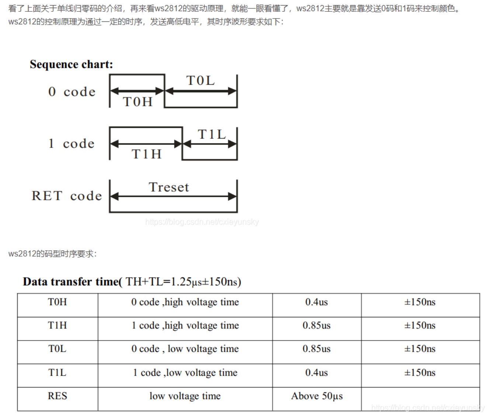

# 知识点总结

- [知识点总结](#知识点总结)
  - [Windows 常用的快捷鍵](#windows-常用的快捷鍵)
  - [三极管使用万用表测量方式](#三极管使用万用表测量方式)
  - [隔离变压器作用](#隔离变压器作用)
  - [DC Load 和 DC Source](#dc-load-和-dc-source)
  - [单极性归零码](#单极性归零码)
  - [PID 总结](#pid-总结)
  - [GNU ARM Toolchain 工具链](#gnu-arm-toolchain-工具链)

## Windows 常用的快捷鍵

- Win + L           锁屏
- Win + D           显示桌面/恢复功能
- Win + E           快速打开文件资源管理器
- Win + X           快速搜索功能
- Win + +           放大桌面
- Win + V           打开粘贴板
- Win + 左右        改变窗口位置
- Win + Tab         新建桌面
- Win + Ctrl + 左右      切换桌面
- Ctrl + Shift + Esc     打开任务管理器

- Ctrl + O          打开文件

- Alt + 空格 + C  =  Alt + F4     关闭窗口
- Alt + 空格 + N   最小化当前窗口
- Alt + 空格 + X   最大化当前窗口
- Alt + 空格 + R   恢复当前窗口
- Alt + 空格 + M   移动窗口
- Alt + 空格 + S   改变窗口大小
- Alt + 回车       查看文件属性

## 三极管使用万用表测量方式

## 隔离变压器作用

- 首先通常我们用的交流电源电压一根线和大地相连，另一根线与大地之间有220V的电位差。人接触会产生触电。而隔离变压器的次级不与大地相连，它的任意两线与大地之间没有电位差。人接触任意一条线都不会发生触电，这样就比较安全。
- 隔离变压器也叫安全变压器，是在使用某些电器时为了人身安全而加设的。例如在维修彩色电视机时，因为有彩色电视机的电源部分和市电相连，若维修人员不注意碰到了这部分电路，就会引触电，危及人身安全。但是，如果安装上隔离变压器，就不会触电了，因为隔离变压器的1级与2级是分开的，不关你碰到了哪一跟线，都不会有触电的危险。但千万注意的是，不可同时接触到两根线，否则将会导致触电危险！

总结:

- 市电和大地相连，一旦触碰，人和大地有电势差，就会有电流流过人体
- 隔离变压器，没有和大地相连，它的负极是另一条线，所以，触碰其中一条，不会和大地有电位差
  - 但是同时触碰两条，会有电势差，会触电

为什么测试产品的时候需要接隔离变压器？

- 如果不接隔离变压器，产品地和设备（示波器）地相连，产品所有地方都不能触碰，都有可能触电
- 同时示波器波形混乱，因为是设备地和产品地共地，相互影响，不是产品的直流地
- 如果，产品出现短路，相当于直接市电短路，可能烧坏其他设备

## DC Load 和 DC Source

- 1、DCLoad原理：
  - V/I < Set V/I: 什么都不做
  - V/I > Set V/I: Load 自身消耗，维持恒压，恒流
- 2、DCSource：提供，电压和电流
- 3、充电，放电 Set Load 应该大于Set Source。如果Set Source > Set Load，电源会给负载充电，因为，负载需要消耗电能，稳定设置的电压或电流。
- 4、为什么在SSE充电的时候，有问题？

因为：Load 设置比较大，Load作用就是限制充电电压不升高；Load 大了，就无法限制电压上升，所以电压会超过 BAT_OVER 电压；

## 单极性归零码

stm32 控制 WS2812(RGB) LED 灯

- 参考网址：
  - https://blog.csdn.net/m0_47699870/article/details/116226342
  - https://blog.csdn.net/qq_41122414/article/details/113555489
  - https://blog.csdn.net/cxieyunsky/article/details/104854695

故此，排除掉直接翻转I/O口的方式，采用 PWM+DMA 或者 SPI+DMA 的方式驱动它

- 用8个位的SPI模拟一个位的单极性归零码
- RGB颜色转换，RGB颜色对照表 (oschina.net)
  - https://tool.oschina.net/commons?type=3

IO翻转控制

- STM32驱动 WS2812D 全彩LED_霁风AI-CSDN博客_stm32f103驱动ws2812； https://blog.csdn.net/wwt18811707971/article/details/82529967
- STM32平台下的TM1812驱动_Andy001847的专栏-CSDN博客_tm1812驱动程序； https://blog.csdn.net/andy001847/article/details/77975802

参考程序

- WS2812 + SPI + DMA
  - 【STM32】WS2812介绍、使用SPI+DMA发送数据 - 夜桜が舞う - 博客园 (cnblogs.com)； https://www.cnblogs.com/PureHeart/p/11349495.html

## PID 总结

- PID：P 比例；I 积分；D 微分；
- PID 算法通过误差信号控制被控量，而控制器本身就是比例、积分、微分三个环节的加和

- 比例参数 Kp： 控制器的输出与输入偏差值成比例关系。系统一旦出现偏差，比例调节立即产生调节作用以减少偏差。
  - 特点：过程简单快速、比例作用大，可以加快调节，减小误差；但是使系统稳定性下降，造成不稳定，有余差。
- 积分参数 Ki： 积分环节主要是用来消除静差，所谓静差，就是系统稳定后输出值和设定值之间的差值
  - 积分环节实际上就是偏差累计的过程，把累计的误差加到原有系统上以抵消系统造成的静差。
- 微分参数 Kd： 微分信号则反应了偏差信号的变化规律，或者说是变化趋势，根据偏差信号的变化趋势来进行超前调节，从而增加了系统的快速性。
- 综上所述，我们需要PID的原因无非就是普通控制手段没有办法使输出快速稳定的到达设定值。比如：温度，转速，液位

具体内容参考：

- 本路径下：PID总结.docx
- Stm32_Platform\STM32_Developm_List\时间触法嵌入式系统设计模式\时间触发嵌入式系统笔记.md
  - 这本书里面有更通俗的 PID 算法讲解

## GNU ARM Toolchain 工具链

- 参考网址：https://blog.csdn.net/love131452098/article/details/115449563

把源代码变成单片机可执行的二进制文件有三个步骤：编译，链接，重定位；

- 编译（Compiler）：源文件（.c, .h） -> Object files； 这个过程把高级语言转换成机器码（二进制）
  - 不同的处理器，操作码是不同的，所以编译后的二进制码不同
  - 比如：ARM 和 X86 操作码不同； HT 和 ST 操作码也不同； 所以，他们的工具链就不同
  - 用 PC 编译 ARM 就属于交叉编译；编译后的二进制文件，只能在ARM 上运行
- 链接：代码通常有 3 个部分；.text(放代码)；.data（放初始化全局变量）；.bss(未初始化全局变量)
  - 高级语言 C，C++ 等支持多文件，多模块开发；链接就是把这些文件整合成一个大文件
  - 把所有 .text 放到一起，.data 放到一起，成为目标文件
- 重定向：不同的芯片 Flash 和 RAM 地址是不同的，这一步就是把 .text 放到对应 Flash 中，把 .data 放到对应 RAM 中

GNU ARM Toolchain 和 GCC 都是同一类，都属于工具链

- 参考网址：https://blog.csdn.net/jf_52001760/article/details/127256332

GNU ARM Toolchain 工具链的可执行程序详解

- arm-none-eabi：主要用于编译 ARM 架构的裸机系统，不适用编译 Linux 应用 ApplicaTIon
  - 一般适合 ARM7，Cortex-M 和 Cortex-R 内核架构的芯片开发使用
- eabi 什么意思呢？
  - abi： 二进制应用程序接口（Application Binary Interface (ABI) for the ARM Architecture）
  - eabi： 嵌入式 ABI; 嵌入式应用二进制接口
- 工具链的工具介绍
  - arm-none-eabi-gcc：为 C 语言编译器，可以将 .c 文件转化为 .o 的执行文件
    - 编译命令：arm-none-eabi-gcc -c hello.c
  - arm-none-eabi-ld：为链接器即最后链接所有 .o 文件生成最终可执行文件的工具
    - 一般我们不使用链接器的指令来调用链接器链接文件，而是通过使用 arm-none-eabi-gcc
    - 链接命令：arm-none-eabi-gcc -o hello hello.o
  - arm-none-eabi-objcopy：将链接器生成的文件转化为 .bin/.hex 等烧写的格式，用以下载进入单片机
    - 烧录命令：arm-none-eabi-objcopy hello hello.bin
  - arm-none-eabi-gdb：工具链中的调试器，将它连接到调试器硬件产生的网络端口，就可以进行硬件和代码的调试了
