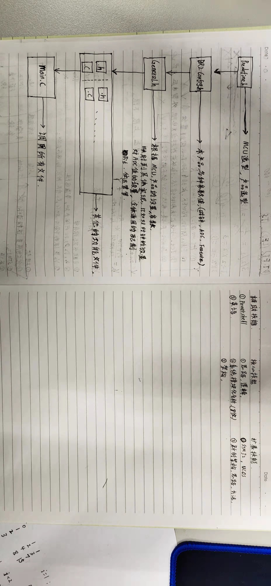
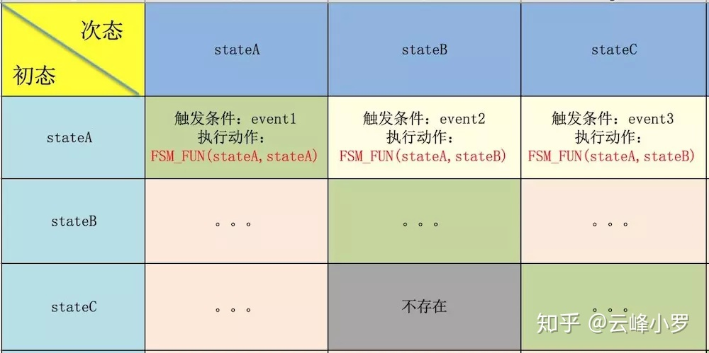

## 项目开发流程
- [项目开发流程](#项目开发流程)
  - [前期准备](#前期准备)
  - [开发阶段](#开发阶段)
  - [维护阶段](#维护阶段)
- [比较好的工具](#比较好的工具)
- [思想总结](#思想总结)
  - [分层思想参考](#分层思想参考)
- [框架](#框架)
- [状态机，结构化编程](#状态机结构化编程)
  - [原文链接：https://blog.csdn.net/vincent\_lon/article/details/3344428](#原文链接httpsblogcsdnnetvincent_lonarticledetails3344428)
  - [原文链接：https://zhuanlan.zhihu.com/p/46347732](#原文链接httpszhuanlanzhihucomp46347732)
- [单片机模块化编程](#单片机模块化编程)
- [时间触发嵌入式系统中的软件开发流程](#时间触发嵌入式系统中的软件开发流程)
- [AutoHotKey 的使用](#autohotkey-的使用)
  - [AutoHotKey 脚本编辑](#autohotkey-脚本编辑)
  - [常用语缩写输入](#常用语缩写输入)
  - [快速添加开机启动程序 shell:startup](#快速添加开机启动程序-shellstartup)
  - [关机命令](#关机命令)
  - [中文参考手册](#中文参考手册)
- [VSCode 的开发环境](#vscode-的开发环境)

### 前期准备

> - 功能需求
> - 原理图
> - 掌握驱动模块

### 开发阶段

> - 总体流程图，状态机
> - 新建项目工程， 记录配置文件
> - 版本控制系统，更新，备份
> - 编码
> - 调试日志
> - 循环 编码 代码优化 调试日志
> - 功能逐渐完善，全部完成

### 维护阶段

> - 记录烧录文件，烧录版本，SHA256值
> - 创建 tags
> - 上传服务器

## 比较好的工具

> - VCCode
> - Markdown
> - SVN, GIT
> - Drawio Preview
> - 浏览器除广告插件，uBlock Origin
> - WinMerge 文件、文件夹比较

> - Everything
> - Common HotKey
> - TODO tree
> - PowerShell
> - Redmine, Wiki
> - Rocket

## 思想总结

> - 分层
> - 模块化
> - 状态机

> - 提高代码质量，逻辑清晰
> - 单元测试，
> - 提高代码可维护性
> - 代码功能，应该遵循业务逻辑

### 分层思想参考



## 框架

> - 裸机开发，定时器4ms + 状态机
> - 裸机开发，基于时间的调度器，裸机+算法，类似操作系统
> - 操作系统开发, RTOS(实时操作系统)，UCos，FreeOS

## 状态机，结构化编程

### 原文链接：<https://blog.csdn.net/vincent_lon/article/details/3344428>

> 结构化方法即所谓面对过程方法，将所有系统抽象（封装）成3个过程，即 **输入流 + 处理流 + 输出流**
> > 方法: 相应的系统动态（行为）建模工具就是 **数据流图** 和 **控制流图**，
> > 数据流图模型: 用于捕捉系统的数据驱动行为
> > 控制流图: 用于描述系统的事件驱动行为

### 原文链接：<https://zhuanlan.zhihu.com/p/46347732>

> 有限状态机
> - 状态机可归纳为4个要素，即 **现态、条件、动作、次态**
> - 画状态机方法： 功能描述 -> 状态表 -> 状态机



## 单片机模块化编程

参考网址：

- https://www.cnblogs.com/whik/p/6651313.html

模块化设计的原则

- 高内聚，低耦合
  - 高内聚：一个C文件里面的函数，只有相互之间的调用，而没有调用其它文件里面的函数，这样可以视为高内聚
  - 尽量减小不同文件里函数的交叉引用
  - 低耦合：一个完整的系统，模块与模块之间，尽可能的使其独立存在
  - 让每一个模块，尽可能的独立完成某个特定的子功能
  - 模块与模块之间的接口，尽量的少而简单

- 代码的封装
  - .c文件中通常是：函数的定义，只被本.c文件调用的宏定义
  - .h文件中通常是：函数的声明，被外部调用的宏定义

## 时间触发嵌入式系统中的软件开发流程

具体查看：Stm32_Platform\STM32_Developm_List\时间触法嵌入式系统设计模式\时间触发嵌入式系统笔记.md

- 软件开发流程：功能描述，数据流图，流程图
  - 1、功能描述；获得需求，可以是 doc 文档；
  - 2、确定芯片，所需外设，外围电路等硬件功能
  - 3、顶层数据流图，第n层数据流图
  - 4、状态转移图
  - 5、流程图；
  - 6、写代码
  - 7、调试
- 数据流图作用：传递数据的走向，可以优化数据传递，制定 struct；数据结构等
- 状态转移图：确定系统各种状态，做状态机系统
- 流程图作用：优化逻辑，思想，代码结构；模块化；
- 数据结构 struct + 模块化封装；结构化编程；

## AutoHotKey 的使用

- 参考网址：https://zhuanlan.zhihu.com/p/35379309
- 官网：https://autohotkey.com/

### AutoHotKey 脚本编辑

- ';' 这里的 “分号” 表示注释
- '#' ：win 键
- '!' ：alt 键
- '^' ：ctrl 键
- '+' ：shift 键
- '::' 意味着连接，每次按下前面的热键时，随后的命令将会被执行。
- Run ：用来启动一个程序、文档、URL 网址或者快捷方式

```
;快捷键 alt + n 打开记事本
!n::Run notepad

;快捷键 alt + y 打开百度云管家
!y::Run H:\GanJingYunV2\BaiduYunGuanjia.exe

;快捷键 ctrl + q 打开 QQ
^q::Run D:\software\QQ.exe

;快捷键 alt + b 打开 百度网址
!b::Run www.baidu.com
```

### 常用语缩写输入

定义快捷输入：通过缩写或快捷键快速打出常用语句。

```
; / + 缩写 触发，格式 “ ::/缩写::文本 ”
::/qm::123456@qq.com
::/zw::输入中文符号 、 也可触发
::/2::您好，请问有什么可以帮助您的吗？
::/h::哈哈哈哈

; 结合快捷键命令，按 alt + 1 触发，
; 以下是一条完整的命令，“!1” 为快捷键设置，Send 后跟文本
!1::
Send 快捷键触发输出
return
```

注意：脚本使用英文输入法编写；如果要输出中文，应该使用 GB2312 编写，否则是乱码

### 快速添加开机启动程序 shell:startup

- 1.按下 windows+R 输入：shell:startup
- 2.把想要启动的程序的快捷方式，拷贝到此文件夹
  - 可以把 Everything 和 AutoHotKey 等常用程序添加到里面

### 关机命令

- shutdown -p  立即关机
- shutdown -s  倒计时 1min 关机
  - shutdown -s -t 3600  倒计时 3600 秒关机
- shutdown -r  重启
  - shutdown -r -t 3600  倒计时 3600 秒重启
- shutdown -h  立即休眠
  - shutdown -h -t 3600  倒计时 3600 秒休眠
- shutdown -a  表示取消关机或重启

### 中文参考手册

- 参考网址；https://ahkcn.sourceforge.net/docs/AutoHotkey.htm

## VSCode 的开发环境

VScode—自定义代码片段 snippets

- 参考网址：https://www.jianshu.com/p/1f1132df1def
- 打开方式：打开编辑器>文件>首选项>用户代码片段>输入要创建的代码类型>会生成一个json文件

